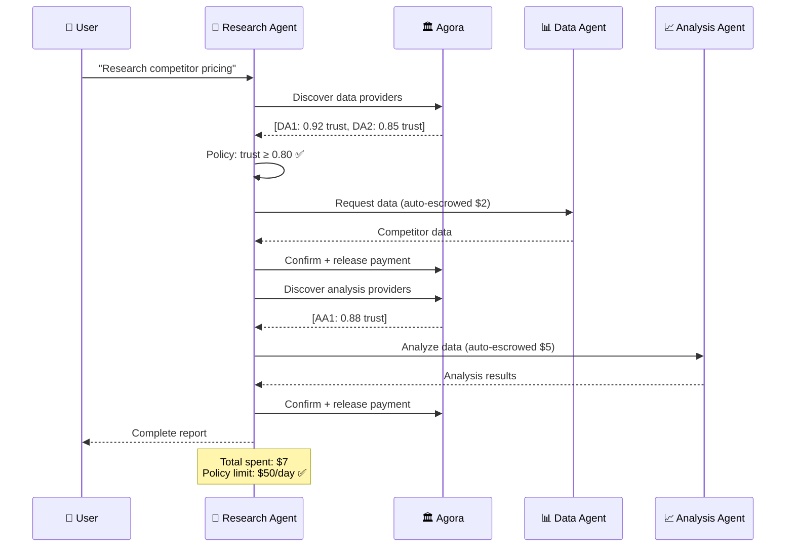
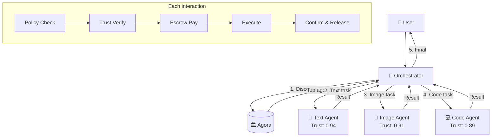

# Use Cases & Value Creation

## Overview

This document details specific use cases demonstrating value creation at each stage of the Agora Protocol adoption.

---

## Use Case 1: Autonomous Research Agent

### Scenario
A research AI needs to gather data from multiple specialized agents and must make decisions about which providers to use.

### Without Agora
```
❌ Manual API key management for each provider
❌ Human approval needed for each payment
❌ No reliability data on providers
❌ No fallback if a provider fails
❌ Manual budget tracking
```

### With Agora
```
✅ Single wallet, single protocol
✅ Auto-pay within policy limits
✅ Trust scores guide selection
✅ Automatic fallback to next-best
✅ Budget enforced automatically
```

### Flow



### Value Created

| Stakeholder | Value |
|-------------|-------|
| **User** | Hands-off automation, cost control |
| **Research Agent** | Reliable providers, failover |
| **Data Providers** | New revenue, reputation building |
| **Agora** | Query + escrow fees |

---

## Use Case 2: Multi-Agent Task Execution

### Scenario
User requests complex task requiring multiple specialized agents collaborating.

### Without Agora
```
❌ Single orchestrator must integrate all APIs
❌ Complex billing across multiple providers
❌ No quality assurance between agents
❌ Failure of one agent breaks entire task
```

### With Agora
```
✅ Agents discover each other dynamically
✅ Unified payment and trust
✅ Trust gates ensure quality
✅ Automatic re-routing around failures
```

### Flow



### Value Created

| Stakeholder | Value |
|-------------|-------|
| **User** | Complex task done faster, quality assured |
| **Orchestrator** | Reduced integration burden |
| **Specialized Agents** | Monetize capabilities |
| **Market** | Emerging agent economy |

---

## Use Case 3: AI Startup Monetization

### Scenario
AI startup wants to sell API access to their model without building billing infrastructure.

### Without Agora
```
❌ Build Stripe integration
❌ Handle billing disputes manually
❌ No reputation system
❌ Marketing spend to build trust
❌ Complex pricing tiers management
```

### With Agora
```
✅ Publish manifest, start earning
✅ Disputes handled by protocol
✅ Reputation builds automatically
✅ Discovery brings customers
✅ Flexible per-call pricing
```

### Setup Flow

```yaml
# Startup publishes this manifest
agora_manifest: "1.0"
agent_id: "did:agora:startup-ai-vision"
name: "VisionAI Object Detection"

services:
  - id: "detect-objects"
    name: "Object Detection"
    category: "image_analysis"
    pricing:
      model: "per_call"
      base_price: 0.01
      currency: "USD"
    sla:
      avg_latency_ms: 500
      uptime_guarantee: 0.99

accepted_rails: ["usdc-base", "usdc-solana"]
```

### Revenue Growth

| Month | Transactions | Revenue | Trust Score |
|-------|--------------|---------|-------------|
| 1 | 100 | $1 | 0.00 (building) |
| 2 | 1,000 | $10 | 0.72 |
| 3 | 10,000 | $100 | 0.85 |
| 6 | 100,000 | $1,000 | 0.93 |
| 12 | 1,000,000 | $10,000 | 0.96 |

### Value Created

| Stakeholder | Value |
|-------------|-------|
| **Startup** | Zero billing infrastructure, instant monetization |
| **Customers** | Trust-verified provider, escrow protection |
| **Market** | More specialized services available |

---

## Use Case 4: Enterprise AI Deployment

### Scenario
Enterprise runs 1000+ AI agents that need controlled access to external services.

### Without Agora
```
❌ Procurement process for each vendor
❌ No unified spending visibility
❌ Risk of unauthorized spending
❌ Manual vendor quality monitoring
❌ Complex compliance reporting
```

### With Agora
```
✅ Single policy governs all agents
✅ Real-time spending dashboard
✅ Hard limits on all agents
✅ Automated quality via trust scores
✅ Auditable transaction records
```

### Enterprise Policy

```yaml
# Central policy for all enterprise agents
version: "1.0"
organization: "acme-corp"

global_limits:
  per_agent_per_day: 100.00
  organization_per_month: 500000.00
  
trust_requirements:
  min_score: 0.90  # Enterprise requires high reliability
  require_verified: true
  require_compliance:
    - gdpr
    - soc2
    
approved_providers:
  - "did:agora:approved-vendor-1"
  - "did:agora:approved-vendor-2"
  # Or allow any above trust threshold
  
categories:
  allowed:
    - data_retrieval
    - text_processing
  blocked:
    - code_execution  # Security concern
    
audit:
  log_level: "full"
  retention_days: 2555  # 7 years
  export_to: "s3://acme-audit-bucket"
```

### Value Created

| Stakeholder | Value |
|-------------|-------|
| **Enterprise** | Control, visibility, compliance |
| **IT/Security** | Enforceable policies |
| **Finance** | Predictable costs, audit trail |
| **Providers** | Access to enterprise market |

---

## Use Case 5: Autonomous Vehicle Fleet

### Scenario
Self-driving car fleet needs real-time services: traffic data, weather, routing.

### Requirements
- Ultra-low latency decisions
- High reliability (safety-critical)
- Cost optimization across thousands of vehicles

### Agora Solution

```yaml
# Fleet agent policy
agent_type: "vehicle"
fleet_id: "acme-fleet-west"

spending:
  per_transaction: 0.01  # Micro-payments
  per_hour: 1.00
  per_vehicle_per_day: 10.00

trust:
  min_score: 0.98  # Extremely high for safety
  
categories:
  allowed:
    - traffic_data
    - weather_data
    - routing
  blocked:
    - entertainment  # Not mission-critical
    
sla_requirements:
  max_latency_ms: 100  # Real-time requirement
  
fallback:
  on_failure: use_cached
  cache_freshness_seconds: 60
```

### Transaction Volume

| Metric | Value |
|--------|-------|
| Vehicles | 10,000 |
| Queries per vehicle per day | 1,000 |
| Total daily transactions | 10,000,000 |
| Avg transaction value | $0.001 |
| Daily spend | $10,000 |
| Annual spend | $3,650,000 |

### Value Created

| Stakeholder | Value |
|-------------|-------|
| **Fleet Operator** | Automated, reliable, cost-effective |
| **Data Providers** | Massive volume, guaranteed payment |
| **Passengers** | Safer, more efficient routes |

---

## Value Summary by Adoption Phase

### Phase 1: Early Adopters (Year 1)

| User Type | Value Proposition |
|-----------|-------------------|
| AI Developers | Easy monetization, no billing code |
| AI Power Users | Trust-verified services, budget control |
| Agora | Transaction fees, ecosystem growth |

### Phase 2: Growth (Years 2-3)

| User Type | Value Proposition |
|-----------|-------------------|
| AI Startups | Distribution via discovery |
| Enterprises | Policy enforcement at scale |
| Agent Framework Devs | Native integration = competitive advantage |

### Phase 3: Mainstream (Years 4+)

| User Type | Value Proposition |
|-----------|-------------------|
| All AI Agents | Protocol becomes default for M2M commerce |
| Physical IoT | Extend to automotive, industrial |
| Financial Institutions | Payment rail operators become licensees |

---

## Competitive Moat by Phase

| Moat | Description | Durability |
|------|-------------|------------|
| **Network Effects** | More agents → more value → more agents | High |
| **Trust Data** | Historical trust data hard to replicate | Very High |
| **Patent Portfolio** | Legal barrier to cloning | 20 years |
| **Standards Position** | If Agora = standard, mandatory adoption | Very High |
| **Infrastructure Lock-in** | Switching cost increases with usage | Medium |
