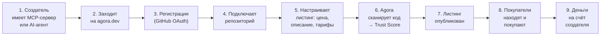
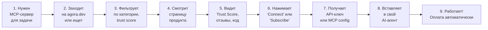
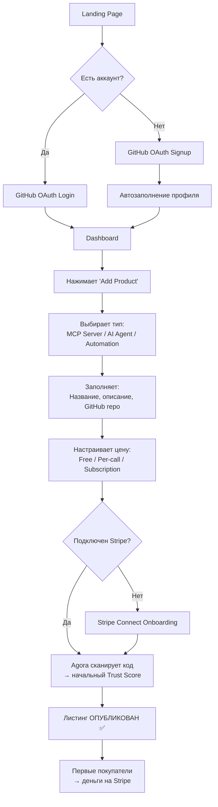
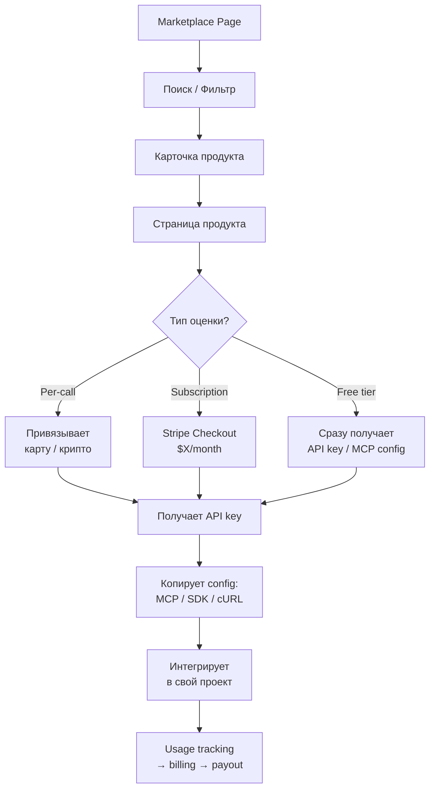

# 🏛️ AGORA — ПОЛНЫЙ ПРОДУКТОВЫЙ ПРОЕКТ

> **Версия**: 2.0 (после обнаружения конкурента Zauth)  
> **Дата**: 19 февраля 2026  
> **Метод**: Chain of Thought — от пользователя к системе

---

## ЧАСТЬ 1: CHAIN OF THOUGHT — КТО НАШ ПОЛЬЗОВАТЕЛЬ?

### Шаг 1: Отправная точка

Мы строим маркетплейс для AI-агентов с trust layer. Но прежде чем строить систему — нужно понять **для кого**.

Вопрос: *Кто проснётся утром и скажет "мне нужен Agora"?*

### Шаг 2: Перебор гипотез

| Гипотеза | Кто | Боль | Вердикт |
|----------|-----|------|---------|
| **H1** | AI API провайдер, продающий модели | Нужен канал дистрибуции + биллинг | ⚠️ Да, но рынок еще маленький |
| **H2** | Создатель MCP-серверов | Сделал полезный MCP-сервер, хочет монетизировать | ✅ **Растущий рынок, 10K+ серверов** |
| **H3** | Indie-разработчик автоматизаций | Построил workflow, хочет продать как сервис | ✅ Горящая потребность |
| **H4** | Enterprise CTO | Хочет покупать проверенные AI-агенты безопасно | 🔜 Да, но долгий sales cycle |
| **H5** | AI agent framework dev (LangChain/CrewAI) | Нужен trust для agent-to-agent вызовов | ⚠️ Среднесрочно |

### Шаг 3: Вывод — MVP пользователь

> [!IMPORTANT]
> **MVP пользователь: Создатель MCP-серверов / AI-автоматизаций, который хочет монетизировать свою работу.**

**Почему именно он:**

1. **Рынок существует сейчас** — 10,000+ MCP-серверов, 97M+ загрузок SDK
2. **Боль реальна** — у MCP **нет встроенной монетизации** (это официальная проблема протокола)
3. **Быстрый time-to-value** — разработчик может залистить сервер за минуты
4. **Сетевой эффект** — больше серверов → больше покупателей → больше серверов
5. **Конкурент Zauth не покрывает** — Zauth работает только с x402 endpoints, не MCP

### Шаг 4: Портрет MVP пользователя

```
╔══════════════════════════════════════════════════════════════╗
║  👤 СОЗДАТЕЛЬ (Supply Side) — "Алекс"                       ║
╠══════════════════════════════════════════════════════════════╣
║  Кто:     Разработчик, 25-40 лет, создаёт MCP-серверы      ║
║           или AI-автоматизации                               ║
║  Навык:   Python/TypeScript, знает API, LLM, MCP            ║
║  Доход:   $3K-15K/месяц (фриланс/работа + side projects)   ║
║  Цель:    Заработать пассивный доход на своём коде           ║
║  Боль 1:  Не знает как монетизировать MCP-сервер             ║
║  Боль 2:  Нет площадки для продажи                           ║
║  Боль 3:  Биллинг слишком сложно строить самому              ║
║  Мотив:   "Хочу как в App Store — залистил и получаю деньги" ║
║  Где:     GitHub, HackerNews, Reddit r/MCP, Discord, X       ║
╚══════════════════════════════════════════════════════════════╝
```

```
╔══════════════════════════════════════════════════════════════╗
║  👤 ПОКУПАТЕЛЬ (Demand Side) — "Мария"                      ║
╠══════════════════════════════════════════════════════════════╣
║  Кто:     AI developer или tech-lead в компании              ║
║  Навык:   Строит AI-агентов, использует MCP клиенты          ║
║  Бюджет:  $100-2000/месяц на инструменты                     ║
║  Цель:    Быстро найти надёжный MCP-сервер для своего агента ║
║  Боль 1:  Тысячи MCP-серверов, непонятно какой надёжный      ║
║  Боль 2:  Нет гарантий что сервер работает                   ║
║  Боль 3:  Нет единого места для поиска и оплаты              ║
║  Мотив:   "Хочу найти проверенный сервис и подключить"       ║
║  Где:     Документация LLM, MCP directory, GitHub            ║
╚══════════════════════════════════════════════════════════════╝
```

---

## ЧАСТЬ 2: ПОЛЬЗОВАТЕЛЬСКИЕ ПРОЦЕССЫ

### Процесс Создателя — от идеи до дохода



**Детальные шаги:**

| Шаг | Действие | Система | Время |
|-----|----------|---------|-------|
| 1 | Заходит на agora.dev | Landing page с CTA "List your agent" | 10 сек |
| 2 | Нажимает "Sign up" | GitHub OAuth (кнопка) | 5 сек |
| 3 | Заполняет профиль | Имя, описание, ссылки | 2 мин |
| 4 | Нажимает "Add Product" | Форма: тип (MCP/Agent/Automation) | 1 мин |
| 5 | Указывает репозиторий | GitHub URL → автоимпорт README | 30 сек |
| 6 | Настраивает биллинг | Ценовая модель: free / per-call / subscription | 2 мин |
| 7 | Подключает получение денег | Stripe Connect Express | 3 мин |
| 8 | Agora сканирует автоматически | Trust Score = code quality + tests + uptime | фон |
| 9 | Публикация | Листинг виден всем | мгновенно |
| **Итого** | | **Листинг за <10 минут** | |

---

### Процесс Покупателя — от поиска до использования



**Детальные шаги:**

| Шаг | Действие | Система | Время |
|-----|----------|---------|-------|
| 1 | Поиск на agora.dev | Search bar + категории + фильтры | 10 сек |
| 2 | Находит продукт | Карточка с Trust Score, ценой, описанием | 30 сек |
| 3 | Открывает страницу | Подробности: README, trust breakdown, reviews | 2 мин |
| 4 | Нажимает "Get Started" | Вариант: Free tier / Pay-per-use / Subscribe | 10 сек |
| 5 | Оплата (если нужна) | Stripe Checkout / x402 микроплатёж | 30 сек |
| 6 | Получает credentials | API key + MCP config snippet для копипасты | 5 сек |
| 7 | Копирует в свой проект | `npx mcp-add agora://service-name` | 10 сек |
| **Итого** | | **От поиска до использования <5 минут** | |

---

### Процесс Агент ↔ Агент (A2A / машинный)

```
┌──────────────────┐     ┌──────────────┐     ┌──────────────────┐
│  AI Agent A      │     │   AGORA      │     │  AI Agent B      │
│  (Покупатель)    │     │   Trust +    │     │  (Продавец)      │
│                  │     │   Payment    │     │                  │
│  1. Нужна услуга ├────►│              │     │                  │
│                  │     │  2. Discovery │     │                  │
│                  │◄────┤     (A2A)    │     │                  │
│  3. Проверяет    │     │              │     │                  │
│     trust score  ├────►│  4. Verify   │     │                  │
│                  │◄────┤     trust    │     │                  │
│  5. Trust OK!    │     │              │     │                  │
│     Платить?     ├────►│  6. Pay via  ├────►│  7. Получает     │
│                  │     │     AP2/x402 │     │     оплату       │
│  8. Получает     │◄────┤  Proxy call  │◄────┤  9. Выполняет    │
│     результат    │     │              │     │     задачу       │
└──────────────────┘     └──────────────┘     └──────────────────┘
```

---

## ЧАСТЬ 3: СИСТЕМНАЯ АРХИТЕКТУРА

### Chain of Thought — какие системы нужны?

```
Вопрос: Какие компоненты минимально необходимы для процессов выше?

Шаг 1: Создатель регистрируется → нужен AUTH SERVICE
Шаг 2: Создатель листит продукт → нужен PRODUCT/LISTING SERVICE
Шаг 3: Agora сканирует код → нужен TRUST ENGINE (уже есть!)
Шаг 4: Покупатель ищет → нужен DISCOVERY/SEARCH SERVICE
Шаг 5: Покупатель платит → нужен PAYMENT SERVICE
Шаг 6: Покупатель использует → нужен API GATEWAY / PROXY
Шаг 7: Оба видят интерфейс → нужен WEB FRONTEND
Шаг 8: Агенты коммуницируют → нужен A2A/MCP BRIDGE

Вывод: 7 основных компонентов
```

### Полная архитектура системы

```
┌─────────────────────────────────────────────────────────────────────┐
│                        КЛИЕНТЫ                                       │
│                                                                      │
│  ┌──────────────┐  ┌──────────────┐  ┌──────────────────────────┐   │
│  │ Web Browser  │  │ AI Agent SDK │  │ MCP Client (Claude, etc) │   │
│  │ (React SPA)  │  │ (TS/Python)  │  │                          │   │
│  └──────┬───────┘  └──────┬───────┘  └────────────┬─────────────┘   │
└─────────┼─────────────────┼───────────────────────┼─────────────────┘
          │                 │                       │
          ▼                 ▼                       ▼
┌─────────────────────────────────────────────────────────────────────┐
│                     API GATEWAY (Nginx/Traefik)                      │
│  • TLS termination  • Rate limiting  • Request routing               │
└──────────────────────────────┬──────────────────────────────────────┘
                               │
          ┌────────────────────┼────────────────────┐
          │                    │                    │
          ▼                    ▼                    ▼
┌──────────────────┐ ┌────────────────┐ ┌──────────────────────┐
│  AUTH SERVICE    │ │ MARKETPLACE    │ │  TRUST ENGINE        │
│                  │ │ SERVICE        │ │  (существует!)       │
│  • GitHub OAuth  │ │                │ │                      │
│  • API keys      │ │ • Listings     │ │  • Trust Score       │
│  • JWT tokens    │ │ • Search       │ │  • ZK Proofs         │
│  • User profiles │ │ • Categories   │ │  • Anti-gaming       │
│  • Permissions   │ │ • Reviews      │ │  • Merkle trees      │
│                  │ │ • Analytics    │ │  • Event history     │
│  Rust/Actix      │ │                │ │                      │
│  PostgreSQL      │ │ Rust/Actix     │ │  Rust (core lib)     │
└────────┬─────────┘ │ PostgreSQL     │ └──────────┬───────────┘
         │           │ Elasticsearch  │            │
         │           └───────┬────────┘            │
         │                   │                     │
         ▼                   ▼                     ▼
┌──────────────────┐ ┌────────────────┐ ┌──────────────────────┐
│  PAYMENT SERVICE │ │ MCP BRIDGE     │ │  CODE SCANNER        │
│                  │ │                │ │  (новый)             │
│  • Stripe Connect│ │ • MCP Registry │ │                      │
│  • x402 handler  │ │ • MCP → Agora  │ │  • GitHub API        │
│  • AP2 handler   │ │    adaptation  │ │  • Code quality      │
│  • Subscriptions │ │ • A2A cards    │ │  • Test coverage     │
│  • Invoicing     │ │ • Tool routing │ │  • Vulnerability     │
│  • Payouts       │ │                │ │    scan              │
│                  │ │ Rust/Actix     │ │  • → Trust Score     │
│  Rust/Actix      │ └────────────────┘ │                      │
│  Stripe API      │                    │  Rust + GitHub API   │
└──────────────────┘                    └──────────────────────┘
         │
         ▼
┌─────────────────────────────────────────────────────────────────────┐
│                        DATA LAYER                                    │
│                                                                      │
│  ┌──────────────────┐ ┌──────────────┐ ┌──────────────────────────┐ │
│  │  PostgreSQL      │ │    Redis     │ │    Object Storage        │ │
│  │  + TimescaleDB   │ │    Cache     │ │    (S3/R2)               │ │
│  │                  │ │              │ │                          │ │
│  │  • Users         │ │  • Sessions  │ │  • Screenshots           │ │
│  │  • Listings      │ │  • Trust     │ │  • Documentation         │ │
│  │  • Transactions  │ │    cache     │ │  • ZK proof artifacts    │ │
│  │  • Trust events  │ │  • Rate      │ │                          │ │
│  │  • Reviews       │ │    limits    │ │                          │ │
│  └──────────────────┘ └──────────────┘ └──────────────────────────┘ │
└─────────────────────────────────────────────────────────────────────┘
```

---

## ЧАСТЬ 4: ТЕХНИЧЕСКИЙ СТЕК

### Chain of Thought — выбор стека

```
Вопрос: Что оставляем? Что добавляем?

ОСТАВЛЯЕМ (уже работает):
✅ Rust + Actix-web → Trust Engine + API (15K SLOC, 170+ тестов)
✅ PostgreSQL + TimescaleDB → Data store
✅ Docker + Kubernetes → Deploy
✅ TypeScript SDK → Client library
✅ Python SDK → Client library
✅ ZK Proofs (Circom) → Trust verification

ДОБАВЛЯЕМ (новое):
➕ React + Vite → Web Frontend (marketplace UI)
➕ Stripe Connect → Payments (Fiat)
➕ GitHub OAuth → Auth flow
➕ Elasticsearch → Search/Discovery
➕ Redis → Cache + Sessions
➕ Cloudflare R2/S3 → Static assets
➕ GitHub Actions → CI/CD

ПОЧЕМУ НЕ Next.js?
→ Наш frontend это SPA-marketplace, НЕ SEO-heavy сайт
→ Landing page можно сделать static HTML для SEO
→ React SPA быстрее для dashboard-интерфейса
→ Минимальная сложность = быстрее MVP
```

### Полная таблица стека

| Слой | Технология | Обоснование | Статус |
|------|-----------|-------------|--------|
| **Backend Core** | Rust + Actix-web 4 | Производительность + safety, 15K SLOC уже есть | ✅ Есть |
| **Database** | PostgreSQL 15 + TimescaleDB | Проверено, масштабируемо, queries уже написаны | ✅ Есть |
| **Cache** | Redis 7 | Sessions + trust cache + rate limits | 🔧 Добавить |
| **Search** | Elasticsearch 8 / Meilisearch | Full-text поиск по marketplace | 🔧 Добавить |
| **Frontend** | React 18 + Vite + TypeScript | SPA для marketplace, team knows React | 🔧 Создать |
| **Styling** | Vanilla CSS (design system) | Контроль + performance, без dependency | 🔧 Создать |
| **State** | Zustand | Легковесный, проще Redux | 🔧 Добавить |
| **Auth** | GitHub OAuth + JWT | Target audience (devs) = GitHub login | 🔧 Создать |
| **Payments (Fiat)** | Stripe Connect Express | Creators получают деньги, мы берём % | 🔧 Создать |
| **Payments (Crypto)** | x402 + AP2 | Machine-to-machine, уже есть hooks | ✅ Hooks есть |
| **File Storage** | Cloudflare R2 | Дёшево, S3-compatible | 🔧 Добавить |
| **CI/CD** | GitHub Actions | Free для open source, уже знаем | 🔧 Настроить |
| **Deploy** | Docker + K8s (DigitalOcean) | Configs уже есть, $80-150/мес | ✅ Configs есть |
| **CDN** | Cloudflare | Frontend static + API protection | 🔧 Добавить |
| **Monitoring** | Prometheus + Grafana | Метрики + алерты | 🔧 Добавить |
| **ZK Proofs** | Circom + Groth16 | Trust verification, конкурентное преимущество | ✅ Есть |

---

## ЧАСТЬ 5: WEB-САЙТ И ИНТЕРФЕЙС

### Какие страницы нужны?

| Страница | URL | Для кого | Зачем |
|----------|-----|----------|-------|
| **Landing** | `/` | Все | Объяснить продукт + конверсия в signup |
| **Marketplace** | `/marketplace` | Покупатели | Каталог + поиск + фильтры |
| **Product Page** | `/marketplace/:id` | Покупатели | Детали + trust + отзывы + "Get Started" |
| **Sign Up / Login** | `/auth` | Все | GitHub OAuth |
| **Creator Dashboard** | `/dashboard` | Создатели | Мои продукты + аналитика + доход |
| **Add Product** | `/dashboard/new` | Создатели | Форма листинга |
| **Settings** | `/dashboard/settings` | Все | Профиль + API keys + Stripe подключение |
| **Product Analytics** | `/dashboard/:id/analytics` | Создатели | Usage stats + revenue per product |
| **API Docs** | `/docs` | Разработчики | OpenAPI + SDK guides |
| **Trust Explorer** | `/trust/:did` | Все | Публичный trust score + ZK proofs |

### Auth Flow (вход/выход)

```
ВХОД (Sign Up / Login):

┌─────────────┐    ┌──────────────┐    ┌──────────────┐
│ Пользователь│    │   agora.dev  │    │   GitHub     │
│             │    │              │    │   OAuth      │
│  1. Click   ├───►│  2. Redirect ├───►│  3. Authorize│
│  "Sign in   │    │   to GitHub  │    │   with the   │
│   with      │    │              │    │   app        │
│   GitHub"   │◄───┤  5. Create   │◄───┤  4. Callback │
│             │    │   session    │    │   with code  │
│  6. В dash  │    │   (JWT)      │    │              │
└─────────────┘    └──────────────┘    └──────────────┘

Данные из GitHub: username, email, avatar, repos list
JWT Token: хранится в httpOnly cookie, 7 дней TTL
Refresh: Silent refresh через /auth/refresh

ВЫХОД (Logout):
DELETE /auth/session → очистить cookie → redirect на /
```

### API Key Flow (для машинного доступа)

```
1. Пользователь: Dashboard → Settings → "Create API Key"
2. Система: Генерирует agora_sk_xxx + записывает hash
3. Пользователь: Копирует ключ (показан только раз)
4. Использование: Header "Authorization: Bearer agora_sk_xxx"
5. Каждый call логируется → billing + analytics
```

---

## ЧАСТЬ 6: БИЗНЕС-ПРОЦЕССЫ

### Процесс 1: Онбординг Создателя



### Процесс 2: Покупка и Использование



### Процесс 3: Trust Score Calculation

```
INPUT SIGNALS:                       WEIGHTS:
┌──────────────────────┐
│ Code Quality         │──────── 20%  (тесты, линтинг, документация)
│ Repository Health    │──────── 15%  (commits, issues, stars)
│ Uptime / Reliability │──────── 25%  (endpoint monitoring)
│ Transaction Success  │──────── 25%  (% успешных вызовов)
│ User Reviews         │──────── 10%  (средний рейтинг)
│ Account Age          │────────  5%  (возраст аккаунта)
└──────────────────────┘
              │
              ▼
   ┌──────────────────┐
   │  TRUST ENGINE    │
   │  (Rust)          │
   │                  │
   │  → Anti-gaming   │  (Sybil, velocity, burst detection)
   │  → Weighted calc │
   │  → ZK Proof gen  │  (можно верифицировать без раскрытия данных)
   │                  │
   └────────┬─────────┘
            │
            ▼
   Score: 0.87 (High Confidence)
   ZK Proof: groth16_proof_xxx...
```

### Процесс 4: Выплата создателю (Payout)

```
1. Покупатель использует продукт → деньги поступают на Stripe Agora
2. Agora берёт 10% комиссию
3. Остальные 90% → Stripe Connect → счёт создателя
4. Выплаты: автоматически, раз в неделю (или по порогу $100)
5. Dashboard: создатель видит доход в реальном времени
```

### Процесс 5: Dispute Resolution

```
Покупатель недоволен → Открывает dispute в Dashboard
→ Agora модератор проверяет: логи вызовов + uptime данные
→ Решение: полный/частичный refund ИЛИ отклонение
→ Trust Score продавца корректируется
→ При 3+ disputes → warning → suspension
```

---

## ЧАСТЬ 7: БАЗА ДАННЫХ — КЛЮЧЕВЫЕ МОДЕЛИ

```sql
-- Пользователи
CREATE TABLE users (
    id          UUID PRIMARY KEY DEFAULT gen_random_uuid(),
    github_id   BIGINT UNIQUE NOT NULL,
    username    VARCHAR(255) NOT NULL,
    email       VARCHAR(255),
    avatar_url  TEXT,
    role        VARCHAR(20) DEFAULT 'creator', -- creator, buyer, admin
    stripe_account_id VARCHAR(255),  -- для payouts
    created_at  TIMESTAMPTZ DEFAULT now(),
    updated_at  TIMESTAMPTZ DEFAULT now()
);

-- Продукты/Листинги
CREATE TABLE listings (
    id          UUID PRIMARY KEY DEFAULT gen_random_uuid(),
    user_id     UUID REFERENCES users(id),
    did         VARCHAR(255) UNIQUE NOT NULL, -- Agora DID
    type        VARCHAR(20) NOT NULL,  -- mcp_server, ai_agent, automation
    name        VARCHAR(255) NOT NULL,
    slug        VARCHAR(255) UNIQUE NOT NULL,
    description TEXT,
    readme      TEXT,  -- auto-imported from GitHub
    github_repo VARCHAR(500),
    
    -- Pricing
    pricing_model VARCHAR(20) NOT NULL, -- free, per_call, subscription
    price_per_call_usd DECIMAL(10,6),
    subscription_price_usd DECIMAL(10,2),
    free_tier_calls INTEGER DEFAULT 100,
    
    -- Trust
    trust_score FLOAT DEFAULT 0.0,
    trust_confidence VARCHAR(10) DEFAULT 'low',
    zk_proof    TEXT,
    
    -- Metadata
    category    VARCHAR(50),
    tags        TEXT[], -- PostgreSQL array
    status      VARCHAR(20) DEFAULT 'draft', -- draft, active, suspended
    
    created_at  TIMESTAMPTZ DEFAULT now(),
    updated_at  TIMESTAMPTZ DEFAULT now()
);

-- API Keys (для доступа к продуктам)
CREATE TABLE api_keys (
    id          UUID PRIMARY KEY DEFAULT gen_random_uuid(),
    user_id     UUID REFERENCES users(id),
    listing_id  UUID REFERENCES listings(id), -- к какому продукту привязан
    key_hash    VARCHAR(255) NOT NULL, -- bcrypt hash
    key_prefix  VARCHAR(20) NOT NULL,  -- agora_sk_xxx для отображения
    permissions TEXT[] DEFAULT '{"read"}',
    rate_limit  INTEGER DEFAULT 100,
    expires_at  TIMESTAMPTZ,
    created_at  TIMESTAMPTZ DEFAULT now()
);

-- Транзакции
CREATE TABLE transactions (
    id              UUID PRIMARY KEY DEFAULT gen_random_uuid(),
    buyer_id        UUID REFERENCES users(id),
    listing_id      UUID REFERENCES listings(id),
    seller_id       UUID REFERENCES users(id),
    type            VARCHAR(20) NOT NULL, -- api_call, subscription, one_time
    amount_usd      DECIMAL(10,6) NOT NULL,
    commission_usd  DECIMAL(10,6) NOT NULL,  -- Agora's cut
    seller_payout   DECIMAL(10,6) NOT NULL,  -- к выплате создателю
    payment_method  VARCHAR(20), -- stripe, x402, ap2
    stripe_payment_id VARCHAR(255),
    status          VARCHAR(20) DEFAULT 'completed',
    created_at      TIMESTAMPTZ DEFAULT now()
);

-- Reviews
CREATE TABLE reviews (
    id          UUID PRIMARY KEY DEFAULT gen_random_uuid(),
    listing_id  UUID REFERENCES listings(id),
    user_id     UUID REFERENCES users(id),
    rating      SMALLINT NOT NULL CHECK (rating BETWEEN 1 AND 5),
    comment     TEXT,
    created_at  TIMESTAMPTZ DEFAULT now(),
    UNIQUE(listing_id, user_id)
);

-- Usage Tracking (TimescaleDB hypertable for time-series)
CREATE TABLE usage_events (
    time        TIMESTAMPTZ NOT NULL,
    api_key_id  UUID NOT NULL,
    listing_id  UUID NOT NULL,
    endpoint    VARCHAR(255),
    status_code SMALLINT,
    latency_ms  INTEGER,
    billed_usd  DECIMAL(10,8)
);
SELECT create_hypertable('usage_events', 'time');
```

---

## ЧАСТЬ 8: ПЛАН РАЗВИТИЯ ПО АУДИТОРИЯМ

### MVP (Сейчас → +3 месяца): Создатели MCP-серверов

| Фича | Приоритет | Для кого |
|------|-----------|----------|
| Marketplace listing | P0 | Создатели |
| Search + Categories | P0 | Покупатели |
| GitHub OAuth | P0 | Все |
| Stripe Connect | P0 | Создатели |
| Trust Score display | P0 | Покупатели |
| API Key management | P0 | Покупатели |
| Creator Dashboard | P1 | Создатели |
| Usage analytics | P1 | Все |

**Целевая метрика**: 50 листингов, 200 покупателей, $500 GMV

---

### V2 (+3-6 месяцев): AI Agent разработчики

| Фича | Приоритет | Для кого |
|------|-----------|----------|
| A2A agent cards | P0 | AI devs |
| Agent-to-agent payment flow | P0 | AI agents |
| ZK trust verification UI | P1 | Enterprise |
| Webhook notifications | P1 | Devs |
| RepoTrust (code scanner) | P1 | Все |
| Reviews + Ratings | P1 | Покупатели |

**Целевая метрика**: 500 листингов, 2K users, $10K GMV/мес

---

### V3 (+6-12 месяцев): Enterprise

| Фича | Приоритет | Для кого |
|------|-----------|----------|
| SSO (SAML/OIDC) | P0 | Enterprise |
| Private marketplace | P0 | Enterprise |
| Compliance audit logs | P0 | Enterprise |
| SLA guarantees | P1 | Enterprise |
| Custom contracts | P1 | Enterprise |
| Multi-region deployment | P1 | Enterprise |

**Целевая метрика**: 5K+ listings, 10K users, $100K GMV/мес, первые enterprise контракты

---

## ЧАСТЬ 9: ЧТО СТРОИМ ПЕРВЫМ (SPRINT 1)

### Неделя 1-2: Фундамент

```
[ ] Scaffold React + Vite + TypeScript
[ ] Design system (CSS custom properties, components)
[ ] GitHub OAuth integration (backend)
[ ] Landing page
[ ] Database migrations (users, listings tables)
```

### Неделя 3-4: Marketplace Core

```
[ ] Add Product form (creator flow)
[ ] GitHub repo import (README auto-pull)
[ ] Marketplace listing page (grid + search)
[ ] Product detail page (trust + description)
[ ] Basic Stripe Connect integration
```

### Неделя 5-6: Usage & Payments

```
[ ] API key generation & management
[ ] Usage tracking (per-call metering)
[ ] Stripe Checkout for subscriptions
[ ] Creator dashboard (products + revenue)
[ ] MCP config generator (copy-paste snippet)
```

### Неделя 7-8: Polish & Launch

```
[ ] Trust Score integration (existing engine → listings)
[ ] Search + categories + filters
[ ] SEO for landing page
[ ] Public beta launch
[ ] 10 MCP-серверов залистить вручную для seed content
```
