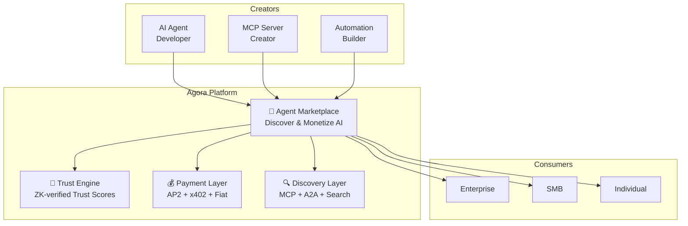

# 🚀 СТРАТЕГИЧЕСКОЕ РЕПОЗИЦИОНИРОВАНИЕ AGORA

> **Цель**: Превратить Agora из "Trust Infrastructure" в **"Trusted AI Agent Marketplace"**  
> **Триггер**: Обнаружение конкурента Zauth (zauthx402.com)  
> **Дата**: 19 февраля 2026

---

## 1. НОВОЕ ПОЗИЦИОНИРОВАНИЕ

### Было (старое)
>
> "Visa/Mastercard для экономики AI-агентов" — Trust Infrastructure

### Стало (новое)
>
> **"Безопасный маркетплейс для монетизации AI-агентов, автоматизаций и MCP-сервисов с enterprise-grade trust layer"**

### Почему это сильнее

| Аспект | Старое позиционирование | Новое позиционирование |
|--------|------------------------|----------------------|
| **Ценность** | Абстрактная "инфраструктура доверия" | Конкретная "зарабатывай на своём AI" |
| **Аудитория** | Только разработчики AI-агентов | Разработчики + компании + индивидуальные создатели |
| **Монетизация** | Только API calls ($0.001) | API + marketplace fees + premium + enterprise |
| **TAM** | Trust verification market | Весь AI Agent marketplace (~$52B к 2030) |
| **Конкурентный ров** | ZK proofs + network effects | ZK proofs + marketplace lock-in + data + MCP ecosystem |

---

## 2. АРХИТЕКТУРА НОВОЙ AGORA



### Четыре Столпа

| Столп | Описание | vs Zauth |
|-------|----------|----------|
| **🏪 Marketplace** | Площадка для листинга, обнаружения и покупки AI-агентов, MCP-серверов, автоматизаций | У Zauth только база эндпоинтов |
| **🔐 Trust Layer** | ZK-verified trust scores, anti-gaming, reputation portability | У Zauth нет ZK, нет anti-gaming |
| **💰 Payments** | Multi-protocol (AP2 + x402 + fiat), multi-chain, escrow | Zauth: только x402 + USDC |
| **🔍 Discovery** | MCP-compatible discovery, A2A cards, semantic search | Zauth: только x402 endpoints |

---

## 3. ЧТО ПРОДАЁМ И КОМУ

### Для Создателей (Supply Side)

| Что могут продавать | Как монетизируют | Наша роль |
|--------------------|-----------------|-----------|
| **AI-агенты** | Подписка, pay-per-use, pay-per-outcome | Trust scoring + платежи + discovery |
| **MCP-серверы** | Pay-per-call, подписка | MCP registry + trust verification |
| **Автоматизации** | Workflow fees, лицензии | Escrow + dispute resolution |
| **Данные/API** | Micropayments через x402 | Payment verification + trust |
| **Плагины/Расширения** | Freemium + premium | Marketplace listing + reviews |

### Для Покупателей (Demand Side)

| Кто | Что получают | Почему у нас |
|-----|-------------|--------------|
| **Enterprise** | Verified agents, SLA, compliance | ZK proofs + enterprise contracts |
| **SMB** | Автоматизация бизнеса, AI tools | Curated marketplace + trust |
| **Indie разработчики** | MCP серверы, agent components | Free tier + community |
| **AI-первые компании** | Agent-to-agent trading | A2A + AP2 + trust engine |

---

## 4. НОВАЯ МОДЕЛЬ МОНЕТИЗАЦИИ

### Revenue Streams (обновлённые)

| Stream | Цена | % Revenue (target 2027) |
|--------|------|------------------------|
| **Marketplace Commission** | 5-15% от транзакций | 40% |
| **Trust API Calls** | $0.001/call (free tier 10K/mo) | 20% |
| **Premium Listings** | $99-499/mo (featured + verified) | 15% |
| **Enterprise** | $50K-500K/year (private deployment, SLA) | 15% |
| **ZK Proof Generation** | $0.01/proof | 5% |
| **Discovery Ads** | CPM/CPC | 5% |

### Unit Economics (обновлённые)

| Метрика | Старая цель | Новая цель |
|---------|-------------|------------|
| **ARPU (creator)** | N/A | $200/mo |
| **ARPU (consumer)** | $10/mo (API) | $50/mo |
| **Take rate** | 0% (API only) | 10% avg |
| **LTV** | $10,000 | $25,000 |
| **CAC** | <$100 | <$150 |
| **LTV/CAC** | >100x | >165x |

---

## 5. MCP ИНТЕГРАЦИЯ — КЛЮЧЕВОЙ DIFFERENTIATOR

### Почему MCP критически важен

- **10,000+** активных публичных MCP серверов (январь 2026)
- **97M+** месячных загрузок SDK
- Принят OpenAI, Google DeepMind, Anthropic
- **Нет встроенной монетизации** → Agora решает эту проблему

### Agora как MCP Marketplace

```
MCP Server Creator → [Регистрация в Agora] → Trust Score + Listing
                                                     ↓
AI Agent Consumer → [Discovers via MCP/A2A] → Pays via AP2/x402
                                                     ↓
                                              Agora takes 5-15%
                                              Creator gets 85-95%
```

### Фичи МСР-интеграции

| Фича | Приоритет | Описание |
|------|-----------|----------|
| **MCP Registry** | P0 | Индексирование MCP серверов с trust scores |
| **MCP Payment Wrapper** | P0 | Монетизация MCP calls через AP2/x402 |
| **MCP Trust Middleware** | P1 | Middleware для автоматической trust-верификации |
| **MCP Analytics** | P1 | Статистика использования для создателей |
| **MCP Marketplace UI** | P1 | Визуальный каталог с фильтрами и рейтингами |

---

## 6. ОБНОВЛЁННЫЙ ROADMAP

### PHASE 2: Marketplace MVP (Q2 2026) ← ПЕРЕСМОТРЕНО

- [ ] MCP Server Registry + indexing
- [ ] Agent Marketplace UI (React + Vite)
- [ ] Integrated payment flow (AP2 + x402 + Stripe)
- [ ] Creator onboarding portal
- [ ] 5 pilot partnerships (AI companies + MCP creators)
- [ ] Public demo + investor deck v2

### PHASE 3: Marketplace Growth (Q3 2026)

- [ ] 100+ listed agents/MCP servers
- [ ] Seed round $3-7M (higher due to marketplace model)
- [ ] RepoTrust (наш ответ на RepoScan, с ZK)
- [ ] A2A-native agent cards с trust metadata
- [ ] Premium listings + verified badges

### PHASE 4: Platform Scale (Q4 2026 - Q2 2027)

- [ ] 1,000+ listed products
- [ ] $50K+ MRR
- [ ] Multi-chain payments (Base, Ethereum, Polygon, Solana)
- [ ] Enterprise API с dedicated deployment
- [ ] AI-powered agent recommendations

### PHASE 5: Market Leadership (2027+)

- [ ] 10,000+ listed products
- [ ] $500K+ MRR
- [ ] Series A $15-30M
- [ ] Industry standard for agent trust + discovery
- [ ] Partnership with Google Cloud / AWS / Azure

---

## 7. ОШИБКИ И СЛАБОСТИ ТЕКУЩЕЙ МОДЕЛИ AGORA

> [!CAUTION]
> Критический самоанализ — что мы делали неправильно и что нужно исправить.

### 🔴 Ошибка 1: "Нет конкурентов" — ложная уверенность

**Было в ROADMAP**: `| None (direct) | - | First mover |`  
**Реальность**: Zauth уже имеет работающие продукты и торгуемый токен.

**Урок**: Конкуренты всегда есть. Нужен постоянный competitive intelligence.

### 🔴 Ошибка 2: Marketplace как второстепенный компонент

**Было**: Marketplace — один из 8 PRD, с пометкой "TODO" на большинство фич.  
**Реальность**: Marketplace — самый мощный source of revenue и lock-in.

**Урок**: Marketplace должен стать **core product #1**, а не "nice to have".

### 🟠 Ошибка 3: Revenue модель слишком линейна

**Было**: $0.001 × API calls = всё.  
**Реальность**: Это гонка к дну по цене. Marketplace commission (5-15%) значительно масштабируемее.

**Урок**: Нужна multi-stream revenue model.

### 🟠 Ошибка 4: Нет MCP стратегии

**Было**: Интеграции A2A + AP2 + x402.  
**Реальность**: MCP стал DE-FACTO стандартом (10k+ серверов, 97M+ загрузок). Мы его пропустили.

**Урок**: MCP — обязательная интеграция для marketplace.

### 🟡 Ошибка 5: Фокус на технологии, а не на PMF

**Было**: 58 файлов, 170+ тестов, ZK-proofs — но 0 пользователей.  
**Реальность**: Zauth имеет работающие продукты и пользователей (crypto-native сообщество).

**Урок**: Технологическое превосходство не заменяет Product-Market Fit. Нужно ускорить GTM.

### 🟡 Ошибка 6: TAM/SAM расчёты нереалистичны

**Было**: "1B агентов × 100 транзакций/день = $100M ARR"  
**Реальность**: Прогноз предполагает невероятное проникновение. Более реалистичный расчёт:

- 2027: 10K агентов × $20/mo = $2.4M ARR (marketplace + API)
- 2028: 100K агентов × $30/mo = $36M ARR

**Урок**: Метрики должны быть bottom-up, не top-down.

---

## 8. СТРАТЕГИЯ ПОЗИЦИОНИРОВАНИЯ vs ZAUTH

### Narrative Battle

| Zauth говорит | Мы говорим |
|---------------|-----------|
| "Trust infrastructure for the autonomous economy" | "Secure marketplace where AI earns and creators get paid" |
| "x402 protocol support" | "Any protocol: MCP + A2A + AP2 + x402" |
| "$ZAUTH token" | "Real revenue: SaaS + marketplace commission" |
| "Endpoint verification" | "Cryptographic trust: ZK-proofs, anti-gaming, reputation" |
| "Crypto-native" | "Enterprise-ready + crypto-compatible" |

### Ключевые Messages для Investors

1. **"Zauth сделал endpoint database. Мы строим App Store для AI-агентов."**
2. **"У них токен. У нас ARR."**
3. **"500ms vs 10ms — наш trust engine в 50-100x быстрее."**
4. **"ZK-proofs — математически доказуемое доверие, не просто uptime check."**
5. **"MCP ecosystem: 10K серверов ждут монетизации. Мы дадим им платформу."**

### Go-to-Market приоритеты

```
Неделя 1-2:  Marketplace UI прототип + MCP registry
Неделя 3-4:  5 MCP-серверов залистить + trust scores
Месяц 2:     Public beta marketplace
Месяц 3:     Investor deck v2 + competitive positioning
Месяц 4:     Первые платящие пользователи
```

---

## 9. UPDATED COMPETITIVE LANDSCAPE

| Конкурент | Что делают | Наш ответ | Наше преимущество |
|-----------|-----------|-----------|-------------------|
| **Zauth** | Trust infrastructure + x402 endpoint DB | Full marketplace + ZK trust | Глубже trust, шире протоколы, marketplace |
| **Masumi Network** | Agent payment layer | Payments integrated с trust | Trust + discovery + payments = bundle |
| **Traditional credit scores** | Human reputation | AI-native reputation | Designed for machines |
| **Blockchain reputation** | Generic on-chain rep | AI-specific, ZK-private | Быстрее, приватнее, cheaper |
| **MCP marketplaces** | MCP server directories | MCP + trust + payments | Trust differentiation |
| **Auth0 / WorkOS** | Agent identity | Agent identity + trust + marketplace | Full platform vs single feature |

---

## 10. КЛЮЧЕВЫЕ МЕТРИКИ УСПЕХА

| Метрика | Q2 2026 | Q4 2026 | Q2 2027 |
|---------|---------|---------|---------|
| Listed agents/services | 50 | 500 | 5,000 |
| Monthly transactions | 1K | 50K | 500K |
| GMV (gross merchandise value) | $10K | $500K | $5M |
| MRR | $1K | $30K | $200K |
| Creator retention | >60% | >70% | >80% |
| Trust verifications/day | 5K | 100K | 1M |
| NPS | >40 | >50 | >60 |
