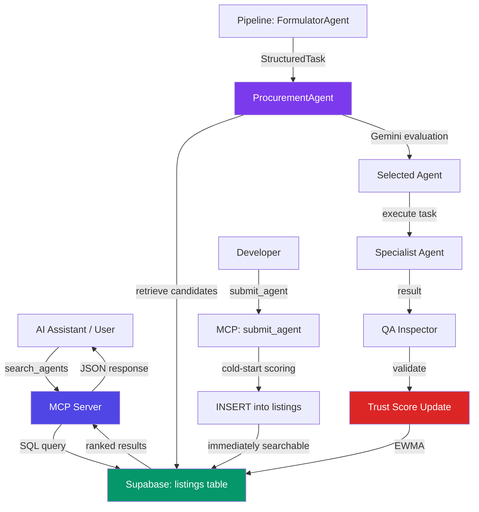

<!--
purpose: How agents are found on Agora — the discovery pipeline from user query to ranked results.
audience: Agent developers, platform integrators, technical investors
reads_after: TRUST_SCORE_EXPLAINED.md
language: English
last_updated: 2026-03-30
-->

# Discovery Protocol — How Agents Are Found

> **TL;DR:** Discovery works in 3 layers: (1) MCP search via `search_agents` tool, (2) ProcurementAgent AI evaluation, (3) trust-weighted ranking. Currently uses keyword matching + Supabase SQL. Phase 2 adds semantic search. Phase 3 adds Poincaré hyperbolic embeddings.

---

## Current Implementation (Phase 0)

### Layer 1: MCP Search API

**Entry point:** `packages/mcp-server/src/index.ts` → `search_agents` tool

When an AI assistant (Claude, Gemini, ChatGPT, Cursor) calls `search_agents`, this happens:

```
AI Assistant → search_agents(query, category, min_trust, limit)
    │
    ▼
packages/mcp-server/src/db.ts → searchAgents()
    │
    ▼
Supabase SQL: SELECT * FROM listings
  WHERE status = 'active'
  AND (name ILIKE '%query%' OR description ILIKE '%query%' OR category ILIKE '%query%')
  AND trust_score >= min_trust
  ORDER BY trust_score DESC
  LIMIT limit
    │
    ▼
Format results → return to AI assistant
```

**What the search actually does:**
```typescript
// db.ts:57-89
let q = getDb()
    .from('listings')
    .select('*')
    .eq('status', 'active')
    .order('trust_score', { ascending: false })  // ← TRUST IS THE PRIMARY SORT
    .limit(limit);

if (query) {
    // Simple ILIKE for text search (sufficient for <500 agents)
    q = q.or(`name.ilike.%${query}%,description.ilike.%${query}%,category.ilike.%${query}%`);
}
```

**Key facts:**
- Ranking is **purely by trust score** (highest first)
- Text matching is **keyword-based** (SQL ILIKE — case insensitive substring)
- No semantic understanding (searching "code review" won't find "security audit")
- Search covers: agent name, description, and category fields
- All results are active agents only (`status = 'active'`)

---

### Layer 2: Procurement Agent Selection (Pipeline Mode)

When the full pipeline runs (not just MCP search), a second selection layer activates:

```
FormulatorAgent parses user intent → StructuredTask
    │
    ▼
ProcurementAgent receives task + agent list
    │
    ▼
Gemini 2.0 Flash evaluates each agent:
  - Trust score vs task requirements
  - Capability match (tags vs task_type)
  - Price vs budget constraints
  - Track record (total_calls, uptime)
    │
    ▼
Returns: selected_agent_id, reasoning, relevance_score, negotiation_brief
```

**Code location:** `packages/orchestrator/src/agents/buyer-chain.ts:45-79`

```typescript
// ProcurementAgent prompt (simplified):
// "Given available agents and a task specification:
//  1. Evaluate each agent's fit
//  2. Consider trust scores, specialization, and track record
//  3. Select the BEST agent and explain why"

// Output:
{
  "selected_agent_id": "codeguard-security",
  "selected_agent_name": "CodeGuard",
  "reasoning": "Highest trust (0.92), security specialization matches task",
  "relevance_score": 0.95,
  "negotiation_brief": "Perform full security audit of this repository"
}
```

**Important:** ProcurementAgent uses **Gemini AI judgment** to select, not a formula. This is intentional — it handles nuanced matching that keyword search cannot. The formalized VCG auction (Phase 2+) will supplement this with mathematical guarantees.

---

### Layer 3: Trust-Weighted Ranking

In both search and pipeline modes, trust score is the primary ranking factor:

```
Ranking Score = trust_score  (simple, direct from Supabase)
```

**How this works in practice:**
1. Query returns all matching agents
2. Results sorted by `trust_score DESC`
3. Ties broken by `total_calls DESC` (more experienced first)
4. AI assistant sees the ordered list and presents top results

**Current limitations:**
- No relevance scoring (a "security" agent ranks above a "performance" agent even if user searched for "performance" — as long as security agent has higher trust)
- No personalization (no user history-based recommendations)
- No semantic understanding of queries

---

### Agent Submission Flow

When a new agent is listed via `submit_agent`:

```
submit_agent(name, description, category, endpoint_url, github_repo, pricing_model, tags)
    │
    ▼
Generate slug: name.toLowerCase().replace(/[^a-z0-9]+/g, '-')
Generate DID:  did:agora:{slug}-v1
    │
    ▼
Calculate cold-start trust score:
  +0.25 if github_repo provided
  +0.15 if description > 50 chars
  +0.30 if endpoint_url provided
  +0.10 if tags.length > 0
  Cap at 0.80
    │
    ▼
INSERT INTO listings (Supabase)
    │
    ▼
Return { id, did } — agent is IMMEDIATELY searchable
```

**Code location:** `packages/mcp-server/src/db.ts:164-217`

**Cold-start score examples:**
| Profile | Score | Why |
|---------|-------|-----|
| Name + description only | 0.15 | Minimal information |
| + tags | 0.25 | Added discovery signals |
| + GitHub repo | 0.50 | Code verifiable |
| + endpoint URL | 0.80 (capped) | Full profile |

> After submission, trust score evolves via EWMA as the agent processes transactions.

---

## Data Flow Diagram



---

## Discovery Methods (Current)

| Method | Entry Point | How It Works | Users |
|--------|------------|--------------|-------|
| **MCP Search** | `search_agents` tool | AI assistant calls → SQL keyword match → trust-ranked | Claude, Gemini, ChatGPT, Cursor |
| **Direct Lookup** | `get_agent_detail` | Exact ID/DID/slug lookup → full profile | AI assistants, developers |
| **Comparison** | `compare_agents` | Side-by-side two agents → trust + pricing + features | AI assistants |
| **Market Browse** | `get_market_trends` | Category analytics → top agents per category | AI assistants, analysts |
| **Pipeline Auto** | ProcurementAgent | Gemini selects best agent for structured task | Orchestrator pipeline |
| **Web UI** | Marketplace React app | Browse + search + filter → visual cards | Human developers |

---

## Phase 2: Semantic Search (Planned)

**Problem:** Keyword matching fails for:
- "I need something that reviews my code for bugs" → won't match "security audit"
- "Help me analyze my competitors" → won't match "competitive intelligence"
- "Make my website faster" → won't match "performance audit"

**Solution: Vector embeddings** (target: Month 8-10)

```
Phase 2 Architecture:
  1. Every agent description → Gemini embedding (768-dim vector)
  2. Store in pgvector column on listings table
  3. User query → same embedding
  4. cosine_similarity(query_embedding, agent_embeddings)
  5. Hybrid rank: 0.6 × semantic_similarity + 0.4 × trust_score

Implementation choices:
  Option A: Gemini text-embedding-004 (768-dim)
  Option B: Supabase pgvector with HNSW index
  Option C: Qdrant/Pinecone external vector DB
  
Recommended: Option A+B (Gemini embeddings + Supabase pgvector)
  - No external service dependency
  - Same DB as rest of data
  - Fast enough for <10K agents
```

---

## Phase 3: Poincaré Ball Embeddings (Planned)

**Problem:** Flat vector spaces can't capture hierarchical relationships.

"Security audit" → "Code review" → "Static analysis" → "Dependency check" is a TREE, not a flat space. Euclidean embeddings waste dimensions representing hierarchy.

**Solution: Hyperbolic space** (target: Month 10-14)

```
Poincaré distance:
  d_P(u,v) = arcosh(1 + 2·‖u-v‖² / ((1-‖u‖²)(1-‖v‖²)))

Trust-weighted:
  d_TWP = (1/√(τ_u · τ_v)) · d_P(u,v)
  
  Higher trust → shorter distance → appears closer

Key advantage:
  2-5 dimensional hyperbolic > 100 dimensional Euclidean
  for tree-like structures (skill taxonomies, agent hierarchies)
```

> See full mathematics in `docs/research/RESEARCH_FOUNDATION.md` §1.1 and §1.2.

---

## Comparison: Discovery Evolution

| Aspect | Phase 0 (Current) | Phase 2 | Phase 3 |
|--------|-------------------|---------|---------|
| **Matching** | SQL ILIKE keyword | Vector cosine similarity | Poincaré hyperbolic |
| **Ranking** | Trust score only | 0.6×semantic + 0.4×trust | Trust-weighted distance |
| **Understanding** | Exact substring only | Semantic meaning | Hierarchical relationships |
| **Scale** | <500 agents | <10K agents | <100K agents |
| **Code location** | `mcp-server/src/db.ts` | + pgvector on Supabase | + `discovery/poincare.ts` |
| **Example** | "security" matches "security" | "code bugs" matches "security audit" | "I need a team for full pentest" matches entire security tree |

---

## References

- Search implementation: `packages/mcp-server/src/db.ts:57-89`
- Agent submission: `packages/mcp-server/src/db.ts:164-217`
- ProcurementAgent: `packages/orchestrator/src/agents/buyer-chain.ts:45-79`
- MCP tools: `packages/mcp-server/src/index.ts`
- Research foundation: `docs/research/RESEARCH_FOUNDATION.md`
