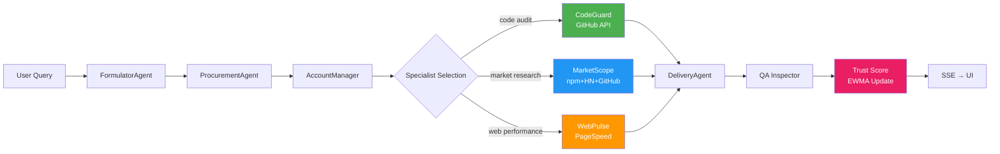
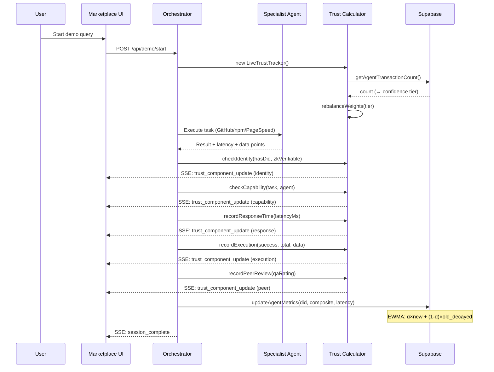

<!--
purpose: Honest system architecture — what exists vs what's planned
audience: Developers, AI systems, pitch judges who do due diligence
last_updated: 2026-03-30
-->

# Agora — Honest Architecture Map

> **Rule:** If it's not in `packages/*/src/`, it does NOT exist.
> Every diagram below is verified against the actual codebase as of 2026-03-30.

---

## 1. What EXISTS Today (Phase 1)

```
┌─────────────────────────────────────────────────────────────────┐
│                        USER LAYER                                │
│                                                                  │
│  ┌──────────────┐   ┌──────────────┐   ┌──────────────────────┐ │
│  │ Marketplace  │   │ Claude/Gemini│   │ Any MCP Client       │ │
│  │  (React UI)  │   │ (AI Desktop) │   │ (stdio transport)    │ │
│  │  port:5173   │   │ via MCP      │   │                      │ │
│  └──────┬───────┘   └──────┬───────┘   └──────────┬───────────┘ │
│         │ HTTP/SSE         │ stdio                 │ stdio       │
└─────────┼──────────────────┼──────────────────────┼─────────────┘
          ▼                  ▼                      ▼
┌─────────────────┐  ┌──────────────────────────────────────────┐
│  Orchestrator   │  │           MCP Server                      │
│  Express API    │  │  @modelcontextprotocol/sdk                │
│  port:3001      │  │  8 tools (search, trust, filter, details) │
│                 │  │  Reads from same Supabase                 │
│  5 endpoints:   │  └──────────────────┬───────────────────────┘
│  POST /demo/    │                     │
│   start         │                     │
│  GET /demo/     │                     │
│   stream (SSE)  │                     │
│  GET /demo/     │                     │
│   session/:id   │                     │
│  GET /agents    │                     │
│  GET /health    │                     │
└────────┬────────┘                     │
         │                               │
    ┌────▼────────────────────────────────▼──────────────────────┐
    │                    SUPABASE CLOUD                           │
    │              PostgreSQL + Auth + RLS                        │
    │                                                             │
    │   ┌───────────┐  ┌───────────────┐  ┌──────────────┐      │
    │   │ listings  │  │ transactions  │  │ usage_logs   │      │
    │   │ (agents)  │  │ (completed)   │  │ (API calls)  │      │
    │   │           │  │               │  │              │      │
    │   │ trust_    │  │ commission_   │  │ latency_ms   │      │
    │   │ score     │  │ usd (10%)    │  │ status_code  │      │
    │   │ (EWMA)    │  │               │  │              │      │
    │   └───────────┘  └───────────────┘  └──────────────┘      │
    └────────────────────────────────────────────────────────────┘
         │
    ┌────▼────────────────────────────────────────────────────────┐
    │                   EXTERNAL APIs                              │
    │                                                              │
    │   🤖 Gemini 2.0 Flash    (agent reasoning — all 8 agents)   │
    │   📦 GitHub REST API     (CodeGuard: repos, commits, deps)  │
    │   📊 npm Registry        (MarketScope: package stats)        │
    │   ⚡ PageSpeed Insights  (WebPulse: Core Web Vitals)         │
    │   💬 HackerNews Algolia  (MarketScope: discussions)          │
    └─────────────────────────────────────────────────────────────┘
```

---

## 2. Trust Score Pipeline (What ACTUALLY Happens)

```
Transaction Start
       │
       ▼
┌──────────────────────────────────┐
│  LiveTrustTracker (per session)  │
│  All components start at 0.000   │
└──────────┬───────────────────────┘
           │
   ┌───────┼───────────────────────────────────────────────┐
   │       │  6 Components Computed in Sequence             │
   │       ▼                                                │
   │  ┌─────────┐  ┌───────────┐  ┌──────────┐            │
   │  │Identity │  │Capability │  │Response  │            │
   │  │ hasDID? │  │  keyword  │  │  actual  │            │
   │  │ ZK?     │  │  overlap  │  │ latency  │            │
   │  │(0.6/1.0)│  │ (0-1)     │  │ (0-1)    │            │
   │  └────┬────┘  └────┬──────┘  └────┬─────┘            │
   │       │             │              │                   │
   │  ┌────▼────┐  ┌────▼──────┐  ┌────▼─────┐            │
   │  │Execution│  │Peer Review│  │ History  │            │
   │  │ API ok  │  │ QA rating │  │ Supabase │            │
   │  │ / total │  │   /5      │  │ txn cnt  │            │
   │  │ + data  │  │           │  │          │            │
   │  └────┬────┘  └────┬──────┘  └────┬─────┘            │
   │       │             │              │                   │
   └───────┼─────────────┼──────────────┼───────────────────┘
           │             │              │
           ▼             ▼              ▼
   ┌────────────────────────────────────────────────────────┐
   │        SSE → UI (real-time progress bars)              │
   │   Each component emits trust_component_update event    │
   └────────────────────────────────────────────────────────┘
           │
           ▼
   ┌────────────────────────────────────────────────────────┐
   │   ADAPTIVE WEIGHTS (by confidence tier)                │
   │                                                        │
   │   Tier determined by getConfidenceTier(transactionCount)│
   │   new (0-2) → low (3-10) → medium (11-50) → high (50+)│
   │                                                        │
   │   composite = Σ (component_score × tier_weight)        │
   └────────────────────────────────────────────────────────┘
           │
           ▼
   ┌────────────────────────────────────────────────────────┐
   │   EWMA PERSISTENCE (supabase.ts)                       │
   │                                                        │
   │   IF txns < 5: Wilson Score lower bound (z=1.96)       │
   │   ELSE:                                                │
   │     1. Decay: T_old × 0.5^(days/30)                   │
   │     2. Penalty: if score<0.5 → 2× deficit subtracted  │
   │     3. α = 0.12 + 0.58/(1+e^(0.08×(N-30)))           │
   │     4. T_new = α × adjusted + (1-α) × decayed         │
   │   UPDATE listings SET trust_score = T_new              │
   └────────────────────────────────────────────────────────┘
```

---

## 3. Demo Pipeline (8 Agents)



---

## 4. MCP Server Integration

```
┌────────────────────────────────────────────────────────────────┐
│                    AI ASSISTANT (Claude, Gemini)                │
│                                                                │
│  User asks: "Find a security audit agent with trust > 0.7"    │
│                                                                │
│  AI calls MCP tool: search_agents(category: "security",       │
│                     min_trust: 0.7)                            │
└──────────────────────────┬─────────────────────────────────────┘
                           │ stdio (stdin/stdout JSON-RPC)
                           ▼
┌──────────────────────────────────────────────────────────────┐
│              MCP SERVER (packages/mcp-server/src/)           │
│                                                              │
│  8 Tools Available:                                          │
│  ┌──────────────────┬──────────────────────────────────┐     │
│  │ search_agents    │ Filter by category, tags, trust  │     │
│  │ get_agent_detail │ Full agent profile + trust score │     │
│  │ list_categories  │ All available categories         │     │
│  │ get_trust_score  │ Trust breakdown for agent        │     │
│  │ compare_agents   │ Side-by-side trust comparison    │     │
│  │ get_marketplace_ │ Aggregate marketplace stats      │     │
│  │   stats          │                                  │     │
│  │ filter_by_trust  │ Agents above trust threshold     │     │
│  │ get_agent_       │ Transaction history for agent    │     │
│  │   history        │                                  │     │
│  └──────────────────┴──────────────────────────────────┘     │
│                           │                                   │
│                    Supabase Query                              │
└──────────────────────────┬───────────────────────────────────┘
                           ▼
                   ┌───────────────┐
                   │   Supabase    │
                   │   listings    │
                   │   table       │
                   └───────────────┘
```

---

## 5. Lean Reboot: 5 Engines (DEC-006)

```
┌─────────────────────────────────────────────────────────────────┐
│                    AGORA LEAN ARCHITECTURE                       │
│                    (5 Engines, Phase 1-3)                        │
│                                                                  │
│  ┌──────────────────────────────────────────────────────────┐   │
│  │                  🏗️ FOUNDATIONS                           │   │
│  │    Supabase · Auth · Config · MCP Transport · SSE        │   │
│  └──────────────────────────────────────────────────────────┘   │
│         │              │              │              │           │
│  ┌──────▼──────┐ ┌─────▼──────┐ ┌────▼────────┐ ┌──▼────────┐ │
│  │ 🛡️ TRUST    │ │ 🔍 DISCOVER│ │ ⚙️ PIPELINE  │ │ 💰PAYMENT │ │
│  │             │ │            │ │             │ │           │ │
│  │ Phase 1 ✅  │ │ Phase 1 ✅ │ │ Phase 1 ✅  │ │ Phase 2 ❌│ │
│  │ Calculator  │ │ MCP Search │ │ 8-Agent     │ │ Stripe    │ │
│  │ EWMA        │ │ Marketplace│ │ Pipeline    │ │ x402      │ │
│  │ Wilson      │ │ API        │ │ SSE         │ │ Escrow    │ │
│  │ Sigmoid α   │ │            │ │             │ │           │ │
│  │             │ │ Phase 2 ❌ │ │ Phase 2 ❌  │ │           │ │
│  │ Phase 2 ❌  │ │ Poincaré   │ │ Cascading   │ │           │ │
│  │ BTS Audit   │ │ Embeddings │ │ Entropy     │ │           │ │
│  │ Sybil Guard │ │ VCG Auction│ │ Monitor     │ │           │ │
│  │ TEE Verify  │ │ GAT Intent │ │ MDP Optim   │ │           │ │
│  └─────────────┘ └────────────┘ └─────────────┘ └───────────┘ │
│                                                                  │
│  Legend: ✅ = In code    ❌ = Designed, not built                │
└─────────────────────────────────────────────────────────────────┘
```

---

## 6. Competitive Positioning

```
                    TRUST APPROACH
                    
    Static Security              Dynamic Behavioral
    (code scanning)              (interaction scoring)
         │                              │
         │  BlueRock.io                 │  AGORA ⭐
         │  • 9000+ servers scanned    │  • 6-signal EWMA trust
         │  • 22-rule engine           │  • Adaptive weights
         │  • OWASP/CWE mapping        │  • Wilson cold-start
         │  • FREE                     │  • Sigmoid α
         │                              │  • 30-day decay
         │  ≈ Penetration Test         │  ≈ Credit Rating
         │                              │
         ├──────────────────────────────┤
         │                              │
    Infrastructure                 Trust + Discovery
    (routing/auth)                 (scoring + marketplace)
         │                              │
         │  Bifrost (Maxim AI)         │  Smithery
         │  • MCP Gateway              │  • MCP registry
         │  • RBAC + Audit             │  • 4000+ servers
         │  • Go, high-perf            │  • No trust scoring
         │                              │
         │  Composio ($29M)            │  Recall Network ($42M)
         │  • Tool auth + SDK          │  • Blockchain AgentRank
         │  • MCP support              │  • Web3 friction
         │  • Integration focus        │  • Sybil-resistant
         │                              │  • Token gated
```

---

## 7. Data Flow: Trust Score Lifecycle



---

## 8. What Does NOT Exist (Explicit)

| Feature | Claimed Where | Actual Status |
| --- | --- | --- |
| Rust Trust Engine | COFOUNDER_MEMO (old) | ❌ Only Cargo.toml, no src/ |
| ZK Proof Integration | Landing page (old) | ❌ Circuit file exists, never called |
| Dual-Rail Payments | README (old) | ❌ No Stripe, no x402 code |
| Docker/K8s | COFOUNDER_MEMO (old) | ❌ No Dockerfile exists |
| 170+ Unit Tests | COFOUNDER_MEMO (old) | ❌ 1 test file, 209 lines |
| 8 API Endpoints | COFOUNDER_MEMO (old) | ❌ 5 endpoints |
| 29 Components | ARCHITECTURE (old) | ❌ 19 tsx files |
| Merkle Score History | schema.sql | ❌ Table defined, not deployed |
| Agent Registry on-chain | TRUST_ENGINE.md | ❌ ERC-8004 not integrated |
| Semantic Search (pgvector) | Backlog | ❌ Not started |
