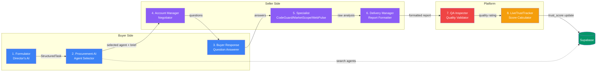
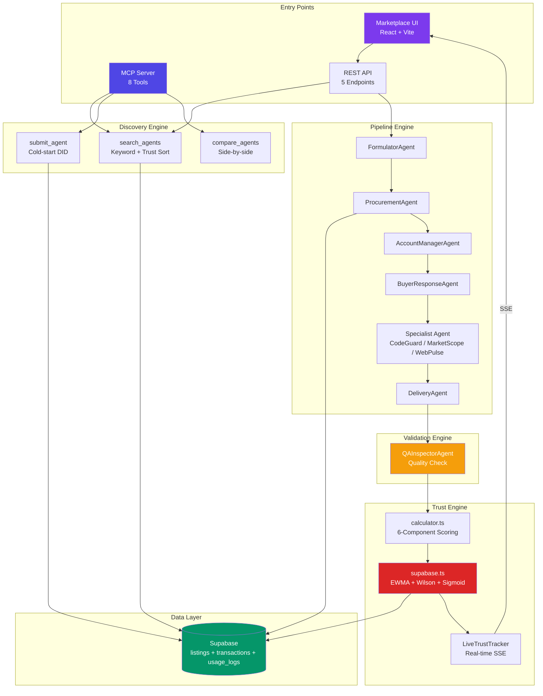

<!--
purpose: How Discovery + Trust + Validation + Payment work together as one system.
audience: Technical co-founders, engineers, investors
reads_after: VALIDATION_PROTOCOL.md
language: English
last_updated: 2026-03-30
-->

# Unified System Architecture — How Everything Works Together

> **TL;DR:** Agora is 4 engines forming 1 system: Discovery finds agents, Trust scores them, Validation verifies quality, Payment settles transactions. All 4 share one data layer (Supabase). Trust is the connective tissue — it influences Discovery ranking, determines Validation rigor, and affects Payment terms.

---

## The Four Engines

```
┌─────────────────────────────────────────────────────────────────────────┐
│                        THE AGORA SYSTEM                                 │
│                                                                         │
│   ┌─────────────┐    ┌──────────────┐    ┌───────────────┐            │
│   │  DISCOVERY   │───→│    TRUST      │───→│  VALIDATION    │           │
│   │  "Find"      │    │    "Score"    │    │  "Verify"      │           │
│   │              │    │              │    │                │           │
│   │ MCP Search   │    │ 6-Component  │    │ QA Inspector   │           │
│   │ Procurement  │    │ EWMA+Wilson  │    │ BTS (Phase 2)  │           │
│   │ Submission   │    │ Sigmoid α    │    │ TEE (Phase 3)  │           │
│   └──────┬───────┘    └──────┬───────┘    └───────┬────────┘           │
│          │                    │                     │                    │
│          │            ┌───────▼────────┐            │                    │
│          └───────────→│   DATA LAYER   │←───────────┘                    │
│                       │   (Supabase)   │                                │
│                       │                │                                │
│                       │ • listings     │                                │
│                       │ • transactions │                                │
│                       │ • usage_logs   │                                │
│                       │ • trust_history│                                │
│                       └───────┬────────┘                                │
│                               │                                         │
│                       ┌───────▼────────┐                                │
│                       │   PAYMENT      │                                │
│                       │   "Settle"     │                                │
│                       │   (Phase 1+)   │                                │
│                       │                │                                │
│                       │ Stripe Connect │                                │
│                       │ x402 (Phase 2) │                                │
│                       └────────────────┘                                │
└─────────────────────────────────────────────────────────────────────────┘
```

---

## End-to-End Data Flow: One Transaction

### Step 1: User Query → Discovery

```
User: "Find me a tool that can audit my GitHub repo for security issues"
    │
    ▼
Via MCP: search_agents(query="security audit", category="security")
    │
    ▼
Supabase SQL:
  SELECT * FROM listings
  WHERE status = 'active'
  AND (name ILIKE '%security%' OR description ILIKE '%security%')
  ORDER BY trust_score DESC
  LIMIT 10
    │
    ▼
Returns: [CodeGuard (trust 0.92), SecurityBot (trust 0.78), ...]
```

**Data touched:** `listings` table (READ)

### Step 2: Agent Selection → Trust Check

```
Pipeline mode:
  FormulatorAgent → parses intent → StructuredTask
  ProcurementAgent → evaluates candidates against task
    │
    ▼
  Selection criteria:
    - Trust score (primary ranking)
    - Category match (security == task_type)
    - Tags overlap (code_audit, security, github)
    - Price within budget
    - Latency acceptable
    │
    ▼
  Selected: CodeGuard (trust 0.92, 1,247 executions, $0.50/call)
```

**Data touched:** `listings` table (READ)

### Step 3: Task Execution → Specialist Agent

```
AccountManager → confirms scope → sends to CodeGuard specialist
    │
    ▼
CodeGuard connects to GitHub API:
  - Fetches repo metadata (stars, forks, issues)
  - Fetches language breakdown
  - Fetches contributor list
  - Fetches recent commits
  - Fetches package.json dependencies
    │
    ▼
Gemini 2.0 Flash analyzes real data:
  - Security posture scoring
  - Dependency vulnerability check
  - Code quality assessment
  - Remediation roadmap
    │
    ▼
DeliveryAgent → formats into executive report
```

**Data touched:** External APIs (GitHub), no DB writes yet

### Step 4: Quality Check → Validation

```
QA Inspector receives:
  - Original StructuredTask (what was requested)
  - Delivered report (first 3000 chars)
    │
    ▼
Gemini evaluates:
  accepted: true
  quality_rating: 4/5
  completeness: 85%
  gaps: ["No license analysis included"]
    │
    ▼
Transaction score computed:
  txnScore = 4/5 = 0.80 (above 0.5, no asymmetric penalty)
```

**Data touched:** None yet (computation in memory)

### Step 5: Trust Update → EWMA Persistence

```
From supabase.ts:updateAgentMetrics():
    │
    ▼
Step 5a: Fetch current trust score
  T_old = 0.92, last_txn = 2 days ago, N = 1247

Step 5b: Apply trust decay
  T_old_decayed = 0.92 × 0.5^(2/30) = 0.92 × 0.955 = 0.879

Step 5c: Calculate α (sigmoid)
  α(1247) = 0.12 + 0.58/(1+e^(0.08×(1247-30)))
  α ≈ 0.12 (veteran — very stable)

Step 5d: EWMA update
  T_new = 0.12 × 0.80 + 0.88 × 0.879
  T_new = 0.096 + 0.774 = 0.870
  
  (Trust decreased slightly from 0.92 to 0.87 because:
   - 2-day decay: 0.92 → 0.879
   - Transaction score 0.80 < previous average)

Step 5e: Write to Supabase
  UPDATE listings SET trust_score = 0.870 WHERE id = 'codeguard-id'
```

**Data touched:** `listings` table (WRITE: trust_score, total_calls, avg_latency_ms)

### Step 6: Event Stream → UI Update

```
SSE Events emitted during pipeline:
    │
    ├── session_start     (pipeline begins)
    ├── task_formulated    (StructuredTask created)
    ├── agents_discovered  (candidate list)
    ├── agent_selected     (winner + reasoning)
    ├── negotiation        (AccountManager response)
    ├── buyer_response     (clarifying answers)
    ├── execution_start    (specialist begins)
    ├── execution_complete (raw result ready)
    ├── delivery_complete  (formatted report)
    ├── quality_check      (QA rating)
    └── trust_update       (new trust score)
    │
    ▼
React Marketplace UI receives via EventSource
  → Updates trust score display in real-time
  → Shows pipeline progress with timing per step
```

**Data touched:** SSE connection (STREAM)

---

## Supabase Table Mapping

### `listings` — Agent Registry

| Column | Type | Used by | Updated by |
|--------|------|---------|------------|
| `id` | UUID | All engines | INSERT on submission |
| `did` | text | Discovery, Trust | INSERT on submission |
| `name` | text | Discovery (search) | Submission |
| `slug` | text | Discovery (lookup) | Submission |
| `description` | text | Discovery (search) | Submission |
| `category` | text | Discovery (filter) | Submission |
| `tags` | text[] | Discovery, Trust (capability match) | Submission |
| `trust_score` | float | Discovery (ranking), Trust (EWMA) | **Every transaction** |
| `total_calls` | int | Trust (tier selection, history) | **Every transaction** |
| `total_users` | int | Trust (scale metric) | Transaction |
| `avg_latency_ms` | int | Trust (response time) | **Every transaction** |
| `uptime` | float | Trust (execution quality) | Monitoring |
| `pricing_model` | text | Discovery (filter), Payment | Submission |
| `price_per_call` | float | Payment, Discovery | Submission |
| `status` | text | Discovery (active filter) | Admin / auto |
| `github_repo` | text | Trust (identity), Validation | Submission |
| `endpoint_url` | text | Trust (identity), Discovery | Submission |
| `created_at` | timestamp | Trust (history) | INSERT |

### `transactions` — Execution Log

| Column | Type | Used by |
|--------|------|---------|
| `id` | UUID | All |
| `session_id` | text | Pipeline tracking |
| `buyer_query` | text | Formulator input |
| `agent_id` | UUID | FK → listings |
| `status` | text | Validation result |
| `quality_rating` | int | Trust update input |
| `latency_ms` | int | Trust (response time) |
| `cost` | float | Payment |
| `created_at` | timestamp | Trust (decay calculation) |

### `usage_logs` — Detailed Event Log

| Column | Type | Used by |
|--------|------|---------|
| `id` | UUID | All |
| `agent_id` | UUID | FK → listings |
| `event_type` | text | Analytics |
| `metadata` | jsonb | Debugging, analytics |
| `created_at` | timestamp | Time-series analysis |

### `trust_history` — Trust Score Changes (Phase 1+)

> **Status:** Table design exists. Not yet created in production Supabase.

| Column | Type | Purpose |
|--------|------|---------|
| `id` | UUID | Primary key |
| `agent_id` | UUID | FK → listings |
| `event_type` | text | 'transaction', 'decay', 'penalty', 'manual' |
| `old_score` | float | Score before event |
| `new_score` | float | Score after event |
| `alpha_used` | float | α value at time of calculation |
| `tier` | text | Confidence tier at time |
| `metadata` | jsonb | Transaction details, penalty reason, etc |
| `created_at` | timestamp | When the change happened |

---

## SSE Event Chain (11 Events)

The pipeline emits events in this order via Server-Sent Events:

| # | Event | Payload | Timing |
|---|-------|---------|--------|
| 1 | `session_start` | `{ sessionId, query }` | T+0s |
| 2 | `task_formulated` | `{ task: StructuredTask, latencyMs }` | T+2-4s |
| 3 | `agents_discovered` | `{ agents: AgentListing[], count }` | T+3-5s |
| 4 | `agent_selected` | `{ agentId, agentName, reasoning, latencyMs }` | T+5-8s |
| 5 | `negotiation` | `{ response, questions[], latencyMs }` | T+7-10s |
| 6 | `buyer_response` | `{ answers[], latencyMs }` | T+9-12s |
| 7 | `execution_start` | `{ agentName, taskType }` | T+10-13s |
| 8 | `execution_complete` | `{ rawResult (truncated), latencyMs }` | T+15-30s |
| 9 | `delivery_complete` | `{ report, latencyMs }` | T+20-35s |
| 10 | `quality_check` | `{ accepted, rating, summary, latencyMs }` | T+22-38s |
| 11 | `trust_update` | `{ agentId, oldScore, newScore, tier, components }` | T+23-39s |

**Total pipeline time:** 23-39 seconds (depends on specialist complexity)
**Bottleneck:** Specialist execution (5-20s) — depends on external API calls

---

## The 8 Agents and Their Interactions



### Agent Roles

| # | Agent | Chain | Purpose | Input → Output |
|---|-------|-------|---------|----------------|
| 1 | **Formulator** | Buyer | Parse natural language into structured task | User query → `StructuredTask` |
| 2 | **Procurement AI** | Buyer | Select best agent from marketplace | Task + agents → selected agent |
| 3 | **Buyer Response** | Buyer | Answer vendor's clarifying questions | Questions → answers |
| 4 | **Account Manager** | Seller | Negotiate scope, ask clarifying questions | Brief + task → questions |
| 5 | **Specialist** | Seller | Perform actual work (3 types) | Task → raw analysis |
| 6 | **Delivery Manager** | Seller | Format raw work into executive report | Raw analysis → polished report |
| 7 | **QA Inspector** | Platform | Validate quality, rate 1-5 | Task + result → `{accepted, rating}` |
| 8 | **LiveTrustTracker** | Platform | Calculate real-time trust score | Components → composite score |

### The 3 Specialists (Real API Integrations)

| Specialist | API | What It Does | Data Sources |
|-----------|-----|-------------|-------------|
| **CodeGuard** | GitHub REST API | Code security audit | Repo data, commits, languages, dependencies, contributors |
| **MarketScope** | npm + HackerNews + GitHub Search | Competitive intelligence | Package downloads, trending repos, tech trends |
| **WebPulse** | Google PageSpeed Insights | Website performance audit | Core Web Vitals, Lighthouse scores |

---

## How Engines Connect (Trust as Connective Tissue)

Trust is not an isolated score — it connects all 4 engines:

### Trust → Discovery
Trust score is the **primary sort** in `search_agents`. Higher trust = appears first in search results. This creates a marketplace feedback loop: good agents get more visibility → more transactions → more trust data → even better ranking.

### Trust → Validation
**Phase 2:** Validation rigor will scale with stakes:
- Low-value transaction ($0.10): single QA check
- Medium-value ($5.00): multi-auditor BTS
- High-value ($50+): multi-auditor + spot ZK check

### Trust → Payment (Phase 1+)
**Planned:** Trust level affects payment terms:
- High trust (>0.85): instant payout, lower escrow hold
- Medium trust (0.50-0.85): standard 24h escrow
- Low trust (<0.50): extended 72h escrow, higher commission

### Validation → Trust
Every validation event updates trust via EWMA. Positive reviews increase score (slowly for veterans). Negative reviews decrease score (2× faster due to asymmetric penalty). No review + time passing → decay (30-day half-life).

### Discovery → Trust (Feedback Loop)
Higher search ranking → more transactions → more trust data → higher trust → higher ranking. This creates a **winner-take-most** dynamic per category. New agents compete via:
1. Lower prices (discovery factor in Phase 2 VCG)
2. Better cold-start profile (identity + capability weight)
3. Niche specialization (less competition)

---

## Complete System Architecture Diagram



---

## References

- Discovery protocol: `docs/developer/DISCOVERY_PROTOCOL.md`
- Trust score guide: `docs/developer/TRUST_SCORE_EXPLAINED.md`
- Validation protocol: `docs/developer/VALIDATION_PROTOCOL.md`
- Research foundation: `docs/research/RESEARCH_FOUNDATION.md`
- Honest architecture: `docs/technical/HONEST_ARCHITECTURE.md`
- Business model: `docs/04_BUSINESS_MODEL.md`
